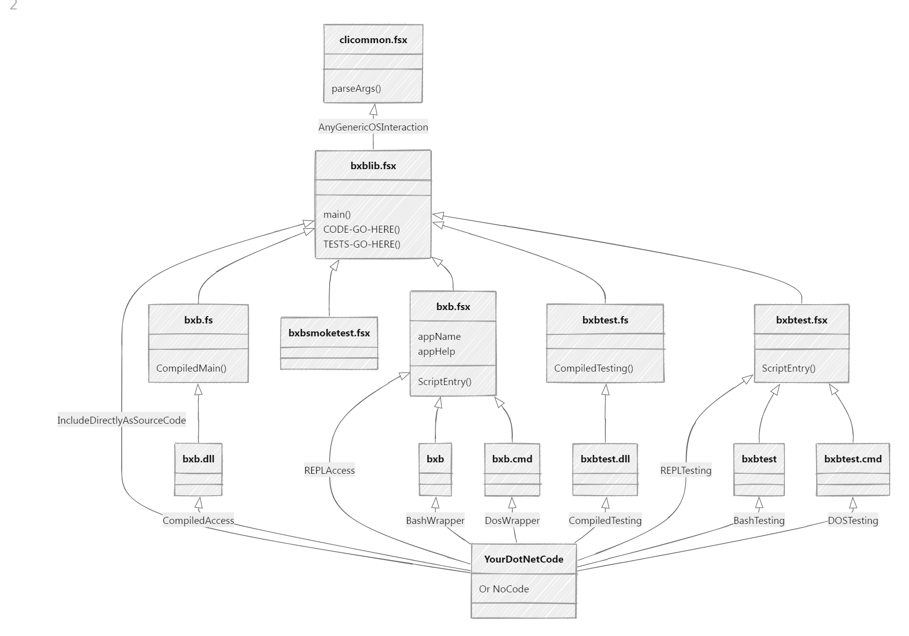

# bxb
Attempt number 4,731 to play with AI-assisted coding

## Goals
1. Create a project template that can be used in future AI-assisted coding sessions
2. Create a dev environment where no frameworks or libraries are required, aside from the OS and dotnet libraries (Which are available on most OSes)
3. Create an environment that is self-validating, that is, has a series of tests that verify that it is working correctly and discussions with the AI will be around which tests are failing and/or which tests to add for new functionality

## Status
Still working on getting modularity in-place. Have decided to use "processing a sparse jagged string array" to be the default functionality, as so much can be done with this as a base and modifying. No tests added.
Thought it'd be fun to add Obsidian as a templated documentation tool.

**The idea is that I should only need to write functions. No other framework or deployment cruft**

## Overview

## Latest
Since this is meant to be a project template for any kind of project, smoke tests are required to make sure data can flow in and out of the underlying OS to the CODE-GO-HERE function in bxblib.fsx Because of that, I went ahead and added a smoketests file. In it, I noted that there are two kinds of smoke tests: testing to make sure the program will never throw an error to the underlying OS no matter what, and testing to make sure that the data can travel in and out as expected.

It's worthy of noting that none of these tests provide any value to the project template user at all, aside from a sanity check that the dang thing is working. If it's working, then you can make your features, change the code, whatever you want to do for your app. "But what if the data isn't shaped the way I wanted?" you might ask. That's a business issue, not a data issue. The program is not broke; you just don't know what you want to do with things 

if there's a missing required piece of the customer record or whatnot. I don't know what you want to do either. This project template simply makes sure that you can start with pure functional coding and deploy it wherever you want. If you want to start in with an OO app and code that way, works great. However you want to code doesn't matter. To a large extent, since dotnet is so ubituitous, even the language selection is irrelevant. Make an app in COBOL.NET and run it from Microsoft DOS on your Mac. Drop it in javascript into a webpage and run it from wherever you want to. The world is your oyster.