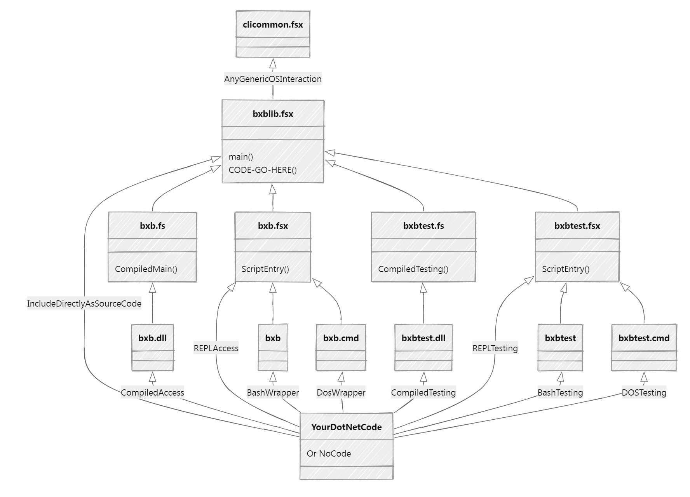

# bxb
Attempt number 4,731 to play with AI-assisted coding

On this attempt, instead of starting from scratch, I'm going to create a basic project template that I can then use in future LLM-Assisted coding sessions.

**The idea is that I should only need to write functions. No other framework or deployment cruft**

Hello Working so far

Now working on modules and dependencies in order to get to the test-first cross platform model I want to use to start LLM conversations

