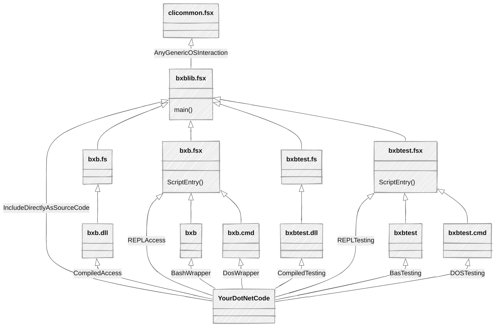

```mermaid
---
config:
  look: handDrawn
  theme: neutral
---
classDiagram


clicommon.fsx
bxblib.fsx
bxb.fsx
clicommon.fsx <|-- bxblib.fsx : AnyGenericOSInteraction
bxblib.fsx <|-- bxb.fsx
bxblib.fsx : main()
bxb.fsx : ScriptEntry()
bxb
bxb.cmd
bxb.fsx  <|-- bxb
bxb.fsx  <|-- bxb.cmd
bxb.fs
bxb.dll
bxblib.fsx <|-- bxb.fs
bxb.fs <|-- bxb.dll


bxbtest.fsx
bxbtest
bxbtest.cmd
bxblib.fsx <|-- bxbtest.fsx
bxbtest.fsx : ScriptEntry()
bxbtest.fsx  <|-- bxbtest
bxbtest.fsx  <|-- bxbtest.cmd
bxbtest.fs
bxbtest.dll
bxblib.fsx <|-- bxbtest.fs
bxbtest.fs <|-- bxbtest.dll

YourDotNetCode
bxblib.fsx  <|-- YourDotNetCode : IncludeDirectlyAsSourceCode
bxb.dll  <|-- YourDotNetCode : CompiledAccess
bxb.fsx  <|-- YourDotNetCode : REPLAccess
bxb  <|-- YourDotNetCode : BashWrapper
bxb.cmd  <|-- YourDotNetCode : DosWrapper


bxbtest.dll  <|-- YourDotNetCode : CompiledTesting
bxbtest.fsx  <|-- YourDotNetCode : REPLTesting
bxbtest  <|-- YourDotNetCode : BasTesting
bxbtest.cmd  <|-- YourDotNetCode : DOSTesting


```

